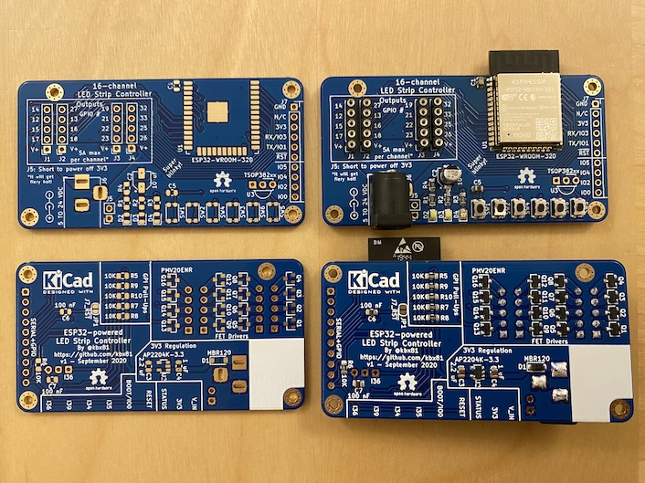

# kbx's 16-channel ESP32 Powered LED Strip Controller

## What?

Just another LED strip/tape controller...because the world needs more blinky!
 It was designed with [ESPHome](https://esphome.io) in mind but should work fine
 with [Tasmota](https://tasmota.github.io/docs/) or any other app, really.

## Why?

I've been using more and more LED tape around my home. In some areas, I have
 multiple sections of the tape but didn't want to have a dedicated controller
 (and that many more Wi-Fi devices on my network) for each section. Sooooo why
 not make a single controller that can control a whole bunch of strips from a
 single ESP32? Here we are.

A benefit of the ESP32 over the ESP8266 is that the ESP32 has dedicated hardware
 for generating PWM. This means that dimming of the LEDs is flicker-free,
 extremely consistent and smooth. While possible on the ESP8266, control
 just...isn't as slick.

These boards are laid out for RGBW strips/tape, but they can be wired up to
 more or less any kind of strips, whether monochrome, RGB, RGBW, RGBWW, the
 variable-color-temperature type...whatever.

They will work with a range of voltages, from 5 volts up to 24 volts. Note
 that the 3.3-volt regulator will likely get **HOT** with a power supply
 of much greater than 12 volts, however, and in such a state its voltage
 output may drop which will trigger the ESP-32's brownout detection, resetting
 the processor. Something to keep in mind.

With the transistors in the BoM, it should be good for up to about 60 watts
 per channel -- but, again, watch for excess heat. Also...don't expect to
 be able to run all 16 channels at the full 60 watts. You're asking for smoke
 and flames if you do so. Still, the layout should be pretty accommodating for
 high currents, especially if the boards are fabricated with 2 oz copper (as
 they should be because current and heat).

## How?

Please see the BoM [here](kbxLEDController-16ch.bom.csv) or
 [here](https://octopart.com/bom-tool/OrMoA1no) for a list of parts needed to
 build one. I had the PCBs fabricated by [Elecrow](https://www.elecrow.com) but
 nearly any PCB fabricator should be able to manufacture these without any issues.

If you have PCBs fabricated, I *highly* recommend having them made with 2 oz
 copper -- it costs a little more but *significantly* improves heat dissipation.

The schematic and PCB were drawn in [KiCAD](https://www.kicad-pcb.org).

See the [ESPHome](ESPHome/) directory for a "demo" configuration you can use with
 [ESPHome](https://esphome.io) to test the device after construction.

 ## Legal stuff and License

The circuit schematics and PCB found here are licensed under the
 [Creative Commons Attribution-ShareAlike 4.0 International License](http://creativecommons.org/licenses/by-sa/4.0/).

_Happy building!_