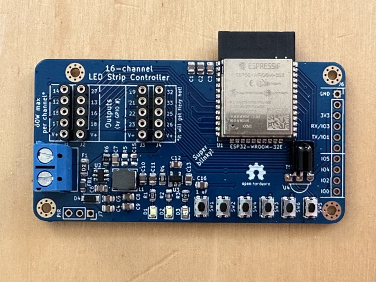

# kbx's 16-channel ESP32 Powered LED Strip Controller

## What?

Just another LED strip/tape controller...because the world needs more blinky! 💡

Note that this board is for linear/"analog" LED tape, not pixels/addressable LED tape. I recommend using a
[Quin LED](https://quinled.info) board if you need to power & drive pixels/addressable LED tape.

For more images, see the [gallery](GALLERY.md).

## Why?

I've been using more and more LED tape around my home. I wanted a replacement for/alternative to using multiple
[Magic Home](https://www.aliexpress.us/item/3256803342079819.html) LED controllers to operate multiple sections of LED
tape within a small area. Of course, having multiple controllers works, but, in my opinion, it's kind of silly and just
piles more unnecessary Wi-Fi devices onto my network. Soooooo why not make a single controller that can control a whole
bunch of strips from a single ESP32? Here we are.

In addition, I wanted something ESP32-based to minimize flicker; soft-PWM used on the ESP8266 drives me crazy in this
sense. A benefit of the ESP32 over the ESP8266 is that the ESP32 has _dedicated hardware_ for generating PWM. This
means that dimming of the LEDs is extremely smooth, consistent and flicker-free -- even at extremely low intensities!
While it's still possible on the ESP8266, LED control is just not as slick and really does not look as nice.

I've optimized this board for size (I wanted it small) and, to a lesser extent, cost. This is why it has machine-pin
headers instead of screw terminals for connecting the LED strips. I also designed it almost entirely with surface-mount
components to keep its overall footprint small -- you can easily hide it in/under a cabinet or behind/under a shelf.

While addressable LED tape is easier to drive, linear/"analog" LED tape tends to be significantly less expensive. As
fun as they are and as neat as they may look, I don't really need addressable LEDs everywhere -- linear strips work
just fine and look just as nice.

## How?

I use this board with [ESPHome](https://esphome.io) (and [Home Assistant](https://www.home-assistant.io)) but it should
work fine with [Tasmota](https://tasmota.github.io/docs/) or any other app, really.

I laid these boards out for [RGBW strips/tape](https://www.amazon.com/dp/B01D1I50UW), but they can be wired up to more
or less any kind of strips, whether monochrome, RGB, RGBW, RGBWW, the variable-color-temperature type...whatever.

They will work with a range of voltages, from 5 volts up to 24 volts.

Please see the BoM [here](kbxLEDController-16ch.bom.csv) or [here](https://octopart.com/bom-tool/OrMoA1no) for a list
of parts needed to build one. I had the PCBs fabricated by [Elecrow](https://www.elecrow.com) but nearly any PCB
fabricator should be able to manufacture these without any issues.

If you have PCBs fabricated, I _highly_ recommend having them made with 2 oz copper -- it costs a little more but
_significantly_ improves heat dissipation and allows for more current.

The schematic and PCB were drawn in [KiCad](https://www.kicad.org).

See the [ESPHome](ESPHome/) directory for a "demo" configuration you can use with [ESPHome](https://esphome.io) to test
the device after construction.

With the transistors in the BoM, _theoretically_ it should be good for up to about 60 watts per channel -- but watch
for excessive heat! Also...do not expect to be able to run all 16 channels at the full 60 watts. You're asking for
smoke and flames if you do so. Still, the layout should be pretty accommodating for high currents, especially if the
boards are fabricated with 2 oz copper (as they should be because current and heat).

## Legal stuff and License

The circuit schematics and PCB found here are licensed under the
[Creative Commons Attribution-ShareAlike 4.0 International License](http://creativecommons.org/licenses/by-sa/4.0/).

_Happy building!_